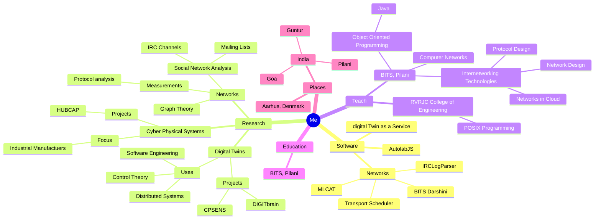

### Hi there 👋

I am a researcher and software developer in the Software Engineering and Computing Systems (SECS) group,
Department of ECE, Aarhus University. My [personal website](http://prasad.talasila.in) tells you more.

### Collaboration 🤝

🔭 I’m currently working on [Digital Twin as a Service](https://github.com/into-cps-association/DTaaS) project.
That is an excellent place to explore collaboration opportunity.

👨‍🔬 These days I spend time researching and prototyping ideas on Digital Twins, Cyber Physical Systems
and Distributed Computing for Manufacturing SMEs. You will find more details from
[my scientific publications](https://scholar.google.com/citations?user=53B5RKoAAAAJ&hl=da&oi=ao).

🤹‍♂️ I'm always looking for interesting commercial problems to apply my professional expertise. I have been a technology consultant primarily for European companies for the past five years. This is an area of enduring interest to me.

### Github Activity 🔥

### Software Development Skills :hammer_and_wrench:

| Area | Languages, Tools and Developer Environments |
|:---|:---|
| DevOps and Cloud |      |
| Languages |          |
| Testing |        |
| Code Quality |        |
| Frameworks |        |
| Documentation |      |
| Packaging |     |

It would have nice to have one technology for each row, but life is complicated. 🤷‍♂️

### My Life 🚶

#### ⚡ I prefer programming over watching TV.
